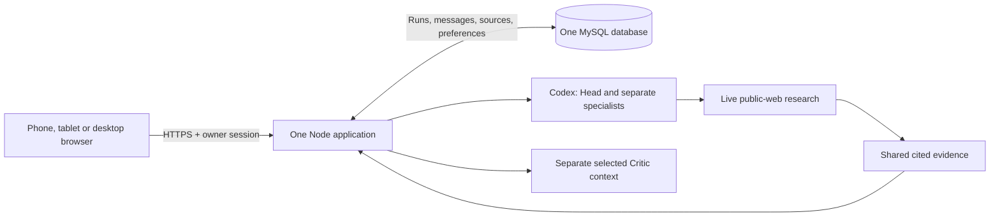

# Proposed architecture

Browser-voice reconciliation, 14 September 2026; Preview-activation reconciliation, 15 September 2026; Critic selector and browser asset-delivery reconciliation, 22 September 2026; managed Codex grant-lifecycle reconciliation, 23 September 2026. The named GoDaddy app's Preview deployment and owned migration are observed. The deployed NanoDuck production-mode override takes precedence over host-owned development `NODE_ENV`; a private Chrome browser reached first-use consent and an existing private Safari session reached Settings, but fresh Google OAuth remains a separate verification. The Published app has served the 22 September revision, and its Settings showed Codex sign-in required; that status alone does not establish whether the seed has expired, refresh failed or another app-server request failed. A real bounded provider turn and database deletion remain separate evidence gates.

## One application with durable work

Serve the UI, Google owner login, consultation endpoints and bounded work coordinator from one Node application in the existing GoDaddy app. Retain the provider process adapters and subscription grants. MySQL stores the authoritative conversation and work state. Keep the browser service, work coordinator and persistence within this application boundary; do not add Redis, a queue service, microservices or a separate AI host.

At each application start, `src/server/browser-assets.mjs` reads the public stylesheets and client modules, rewrites client module imports to content-addressed same-origin URLs, hashes the final bytes and places those URLs in the served HTML. The HTML and private/API responses retain `Cache-Control: no-store`; the versioned CSS/JavaScript URLs change whenever their bytes or imported module bytes change. The server serves only registered hashes, so a stale asset URL cannot impersonate new bytes. This addresses a returning browser that would otherwise reuse older controls after an app update while preserving the existing CSP and without storing private content in browser caches. A Preview update must start a process with the new source and return its current HTML; source tests alone do not prove the host has done so.

## Minimum persistence contract

- Accept a user message and create/advance its run in one transaction. A client request ID prevents duplicate acceptance after retries. A draft is not accepted work.
- A worker leases a run outside the HTTP request lifetime. Each completed agent message and next step commit atomically to one ordered event stream. Save role, recipient, actual body, model snapshot and source associations.
- The browser replays committed events after its last cursor. Prefer authenticated SSE; use authenticated incremental polling if the host buffers streams. No extra delivery outbox is needed because both read canonical events.
- Stop changes the run generation. A late provider response may commit only if its run generation and lease remain valid. No late final result after Stop.
- Restart resumes the last committed step. If a provider finished but no result committed, retry may repeat the model call. Promise one confirmed visible result per step, not exactly-once provider execution.

A failed run uses the same owner-authorized continuation endpoint as a stopped run. The store serializes recovery under the owner lock, rejects another active run, atomically compares the prior generation/status and advances the generation while preserving the accepted snapshot. Recovery notices remain in the saved event stream for display/export, but the coordinator excludes System events from role-step matching and provider discussion context. Resume therefore retries only the missing role; it cannot count a notice as a specialist reply or skip closing contributions. No schema change is required.

This contract is the essential reliability work for a phone browser. It must be tested on the chosen GoDaddy runtime before release.

## Agent and research contract

Head, every selected specialist and Critic receive a separate ephemeral model invocation. The server reconstructs each prompt from the complete ordered owner messages and corrections, every confirmed business message and direct source ledger, plus the role's own exact assignment. System recovery notices and rejected drafts are excluded. A text-only provider sees explicit attachment metadata and an explicit statement that it cannot examine image pixels. The owner-visible Markdown behavioral contract remains encrypted in the app database, validated and versioned on Settings save/restore, and snapshotted with each accepted run. A fresh database uses its one-time deployment-secret bootstrap; no repository file is an active private instruction source. At startup and when resuming an old run snapshot, the prompt-contract module upgrades only exact retired public defaults for Head tasks, output length, Critic challenge and joint final review. It preserves edited sections and prior encrypted revisions. The code-owned Critic reminder requires evidence-based objections and an output-completeness check even when owner wording is customized.

Head Consultant performs internal non-web invocations to enumerate the owner's requested deliverables and choose the actual distinct permitted specialist roster for the selected 1/2/3/5 count or Auto count of 1–5. The server validates roster names/count, persists it in the run snapshot and recovers a former coordinator's committed Head-task prefix without replacing any task. Head writes a considered assignment to each selected specialist; the successful provider text is committed and delivered verbatim to that recipient. There is no XML wrapper, imperative/case-anchor rule, 420-character bound, ordinary-wording retry or generic replacement brief. Provider failure pauses the run truthfully. Each specialist first gives an independent position to Critic. Critic checks the entire owner request, exact assignment, evidence, numerical claims and contradictions, directing specific stop-and-rework for circular, irrelevant, fabricated or unsupported work without inventing a defect. The consultant materially revises, offers a grounded objection or admits unavailable evidence.

Every specialist receives at least one Critic challenge and reply. After each complete team round, Head records CLOSE or CONTINUE and pursues only a useful targeted next round within the selected 1/3/5 ceiling; Auto permits at most 10. Persisted roster, review decisions and confirmed role/recipient sequence allow Stop, Continue, provider failure and restart to resume at the missing step without duplicating a committed contribution. A missing decision after a crash is treated conservatively, not as agreement. Closure gathers every specialist's final position and one joint Critic review of every requested output. Only then does Head address the owner with Consolidated advice, direct source links where available, explicit missing evidence and as many actions as the request needs. Unresolved issues remain provisional. No arbitrary 2,000-character or role-output trim is applied; finite HTTP/storage/provider ceilings fail visibly when exceeded. Outcome selects only the current question's unaddressed Head conclusion. The approved Electric A v8 UI layout and role identities remain unchanged.

Keep the current exact provider/model/effort settings and caps described in [model-settings.md](model-settings.md): Head/specialists remain Codex `gpt-6-astra` / `xhigh`, while future Critic work selects Claude Code `claude-opus-5-5` / `medium`. Use structured internal envelopes only for routing, identity and work status. Natural language messages should not carry hashes, vote tables, procedural stages or artificial acknowledgments. The browser renders a restricted Markdown subset—paragraphs, headings, ordered/unordered lists, quotations, emphasis, inline code and public HTTPS links—through constructed DOM nodes. Raw HTML never executes; unsafe, private or prohibited-host links remain inert and are rejected at the accepted-message/provider boundary.

Add `gpt-6-sol` as an optional model in the Head/specialist and Critic Codex selectors. `src/server/codex-models.mjs` keeps the accepted model/effort allowlist; intersect it with the current Codex `model/list` result before exposing choices, and validate the exact active pair on save and invocation. The inactive Critic Codex branch retains a known model/effort pair even when the live catalog temporarily omits it; switching to that branch requires fresh catalog validation. No new preference revision or migration is needed: existing selected tuples and accepted run snapshots stay intact, while a later supported owner choice affects future runs. Catalog absence or an unsupported effort must produce an unavailable or invalid state, never an automatic fallback.

Persist `critic-opus-5-5-effort-floor-20260922` as the current settings-revision marker in the existing settings JSON. Migration holds the existing database migration lock and row-locks the single owner row in `nanoduck_settings`. A fresh or pre-Opus preference receives the owner-selected Claude Code `claude-opus-5-5` / `medium` tuple once. From the immediately preceding `critic-opus-5-5-medium-20260922` revision, only an active or inactive Claude Opus 5.5 / Low choice advances to Medium; preserve the Codex choice, every other supported Claude choice and unrelated preferences. Neither transition reads or writes `nanoduck_runs`. A current revision is idempotent, so a later supported owner save survives restart. Fresh databases receive the same current defaults. Settings reads and configuration recovery normalize older preferences through the same function, while accepted run snapshots remain exact historical records.

For public research, Head first commits every recipient-bound assignment before any initial research invocation, then forms a minimal query in a non-web invocation before the first specialist position. A slow web search therefore cannot hide confirmed Head work. Validate the exact outgoing query for contacts, credentials and unsafe destinations. Only the safe query and public instructions enter the restricted Codex web-enabled invocation; owner messages, discussion and private saved guidance stay outside it. A private phone elsewhere in the consultation cannot disable safe research, and a numeric identifier in a safe public article URL remains valid. Attach newly obtained validated sources to the first specialist position, not an earlier Head assignment; retain legacy Head-task sources without attaching them again. The shared source ledger reaches every later role and final synthesis without an arbitrary eight-item limit. A non-cancellation planning/search failure or timeout records an unavailable attempt with a safe reason; an unsafe query records a distinct withheld attempt before any web call. Neither case asserts fresh verification, discards earlier valid sources or fails the whole consultation solely for missing research. Stop still aborts the provider operation and fences late results. A Critic evidence gap can lead Head to repeat this isolated path without replaying confirmed rounds. Record content-free provider-step start/completion timestamps, output kind, outcome category and duration for diagnosis; never log prompts, queries, private discussion or rejected text. Keep the existing restricted Codex live-search boundary for that public step. Keep filesystem, arbitrary shell, computer use and unrelated integrations disabled. Claude Critic is text-only: it receives the same owner question, prior confirmed discussion and role/output contract as every other role, including committed Codex research evidence, but it cannot browse or invoke a tool. Its isolated Claude Code command has a hard denial list for all known tools, `dontAsk`, one maximum turn and a text-only system prompt. The source pins Claude Code CLI `2.1.280`, its documented minimum for Opus 5.5. The process boundary passes the saved `claude-opus-5-5` as the exact `--model` ID, passes `medium` unchanged and maps the owner-facing Extra choice to `xhigh`; a legacy `claude-opus-5` run snapshot also passes its exact ID and must fail visibly if unsupported. It must not use the moving `opus` alias, which selected Opus 5 in earlier CLI releases. Release evidence must confirm the installed CLI version and an allowed bounded Opus 5.5 turn. Invocation/transcript syntax is rejected before persistence, receives one bounded text-only retry, and can never reach the event stream or browser. This is a team research path, not a claim that Claude's adapter browses directly. Prompts restrict responses and research to English/Ukrainian; validation rejects distinctive Russian/Belarusian language markers, never a valid Ukrainian shared word such as `які` on its own, and `.ru`, `.by`, `.su` or Cyrillic-equivalent hosts before source records are stored or rendered. A rejected provider draft remains ephemeral: the coordinator re-invokes that exact role and assignment once with a code-owned language/source correction before any run-level failure is considered. The rejected draft, its prohibited links and its diagnostic text never enter the event stream, source store or browser.

Store source title, direct URL, supported claim and retrieval/publication information. Treat retrieved content as untrusted data, minimize queries and never include credentials or private documents by default. Require English/Ukrainian source text and reject prohibited-language metadata at the same boundary as URL validation. A source failure or unsupported claim is visible as a limitation.

## Identity, grants and preferences

Retain the current Google identity boundary for the sole owner and secure server sessions, authorization and CSRF protection. App login protects application access; it does not authorize an AI subscription. Provider credentials remain server-only, encrypted with keys separated from database data. Settings always shows the Critic Claude Code branch and its owner-facing Opus 5.5 / Medium–Max choices, including an explicit preview when the runtime cannot use Claude Code. A content-free managed-authentication check controls whether a changed Claude selection may be saved or invoked; an inactive provider is never invoked with consultation content. The server verifies the selected provider/model/effort tuple again before it accepts a changed preference.

Codex managed authentication has a single durable, server-only grant owner. The deployment's existing `CODEX_APP_SERVER_AUTH_*` value is a seed, not a file to recopy for every operation. On first use, provision one `codex` row in the existing MySQL database with the complete `auth.json` encrypted under a grant-specific key derived from `DATA_ENCRYPTION_KEY` with domain separation. Retain only a SHA-256 fingerprint of the validated managed credential identity (`auth_mode` and refresh token) for seed comparison. An unchanged identity leaves the refreshed row authoritative even if seed formatting or metadata changes; a fresh trusted login with a new refresh token replaces that row for reauthorization. A malformed new seed never overwrites a valid existing row; report a safe bootstrap warning and use that independently validated row, or report authorization unavailable if no row exists. Never expose the row, seed, fingerprint or derived key through an app API, Settings, logs, public artifact or recovery export. A database dump alone must not yield the grant. Losing the separated encryption key makes that row unrecoverable and requires a trusted reseed.

All Codex `inspect` and `invoke` operations consume one serialized grant stream. The active app instance must hold a database-backed leadership/fencing boundary throughout each operation; an in-process mutex prevents its overlapping operations, and a generation compare-and-swap prevents a stale write-back. A second process must not use the same grant concurrently merely because it can read the row. Restore the current encrypted bytes to a private `0600` `auth.json` in an ephemeral app-server home, with `cli_auth_credentials_store = "file"` set in that isolated home so Codex writes renewals there rather than into a keyring. Serialize write-back for that connection, including normal requests, cancellation and cleanup: validate and commit any refreshed file to the encrypted row before removing the home and releasing the grant. On GoDaddy's secret-only host, this temporary home contains the only materialized `auth.json` file used by the app. Preserve an unchanged file without rewriting it. If the active stored grant cannot be read, decrypted or validated, or a refreshed file cannot be committed, fail the provider operation closed, leave the prior durable row untouched, and report only a safe category. Stop and cancellation must still close the child and attempt this write-back. Neither a revoked grant nor a storage error permits a paid API-key fallback or model substitution.

This round-trip follows [OpenAI's managed Codex auth guidance](https://learn.chatgpt.com/docs/auth/ci-cd-auth): Codex itself refreshes `auth.json`; an ephemeral runner must persist its updated file and serialize its auth stream. It does not guarantee an indefinitely valid session. A hard process or host kill after Codex rotates credentials but before the encrypted row commits may leave an obsolete durable copy; without a verified durable host volume or refresh transaction from Codex, this crash window remains. A database write-back failure after token rotation likewise makes the operation fail closed; cleanup removes the only new temporary plaintext copy, so the older database grant may no longer refresh. The operator may need to reseed from a fresh trusted Codex login after such a write-back failure or a genuine selected-provider authorization failure; this is not a routine Settings step. Do not copy a local token to GoDaddy or execute a live provider turn without the applicable separate authorization.

Before cutover, take a content-free saved-settings snapshot, verify both settings-revision transitions and prove the exact active tuples independently, including the installed Claude CLI version, exact model argument and an allowed bounded Opus 5.5 / Medium turn. Routine refresh should be automatic when the managed grant remains valid; revoked access gets one contextual reconnect action. Quota exhaustion gets reset/retry information. No automatic model downgrade or paid fallback.

## Data and product boundaries

Retain complete saved conversations, protected owner-generated image attachments, sources, settings, the owner's single private database-stored runtime-instructions document and run state. Whole-conversation export/delete are owner actions. Sanitize rendered model content and links. Keep public code separate from private runtime state. HTTPS protects browser-to-server traffic, and protected server storage holds private records; do not claim device-to-device E2EE for this architecture.

The [deployment boundary](deployment-boundary.md) names the only allowed target. The source switch, Preview secrets, owned migration and encrypted instruction bootstrap are evidenced on that app. The deployed production-mode override has reached private browser sessions, but a fresh Google callback has not yet been observed. Provider reauthorization/preflight, streaming behavior, a real consultation, browser voice, publication and any authorized database deletion remain release evidence to obtain.

## External capability references

Checked 13 September 2026: [Codex configuration](https://learn.chatgpt.com/docs/config-file/config-reference) documents web-search configuration; [Codex App Server](https://learn.chatgpt.com/docs/app-server) documents managed authentication; [Claude Code authentication](https://code.claude.com/docs/en/authentication) documents subscription authorization for supported automation. Checked 22 September 2026: [Claude Code model configuration](https://code.claude.com/docs/en/model-config) specifies CLI v2.1.280 or newer for Opus 5.5 and the exact `claude-opus-5-5` ID; older `opus` alias resolution could select Opus 5. These describe mechanisms; they do not verify the owner's current grant, quota, model entitlement, a successful Opus 5.5 turn or hosting compatibility.

## Current drivers and source references

This reconciliation consumes the current PRD, context/terms, guardrails, journey, screen map, wireframes and combined-layout design brief with the selected Electric colour refinement and retained comparison references. The prior one-app/one-database proposal above remains. The owner now explicitly requires browser-native voice and functioning Settings selectors; no NanoDuck audio service, database record or provider change is added. Validated against `nanoduck-electric-a-v8-20260914`, the exact Electric A v8 target/tree and scope in the design brief. Its approval adds no service, database, role privilege or data exposure; the one-app architecture covers all nine surfaces and 44 states.

Local source observation at 2026-09-22T20:33:53Z: `src/server/index.mjs` serves the HTML and registered asset bytes from `src/server/browser-assets.mjs` with no-store and the existing same-origin CSP; `test/browser-assets.test.mjs` covers hash changes, imported modules, response bytes and wrong-hash denial. `src/client/app.js` and `public/index.html` render the Critic provider selector, while `src/server/settings.mjs`, `src/server/validation.mjs` and `src/server/claude-provider.mjs` define the current saved choice and compatible Claude effort catalog. These are repository observations, not evidence that the named GoDaddy Preview serves this revision or that a managed Claude turn succeeds.

The 23 September Codex correction is scoped to the pre-fix `eb77ee33` checkout behavior and the Published Settings observation. `git show eb77ee33:src/server/codex-provider.mjs` (SHA-256 `ccf55470ef499fe9375b4b3d3e6a5bec59c3ae0808597b8aae67ac4ae31e9604`) showed a deployment auth seed copied to a new temporary home for every inspect/invoke and that home removed on close, with no persistence of a refreshed `auth.json`. The published status did not identify a definitive root cause. Implementation and live verification must be recorded separately after this architecture decision.

## Module and boundary map

| Boundary | Product obligations and local consequence |
|---|---|
| Browser shell | UC-001/UC-003/UC-005; FR-05.1, FR-08.1–08.3, NFR-02.1–02.3. One persistent menu-bar button, outside both responsive destination lists, renders Login/Logoff state from `GET /api/session`. Login reuses `POST /auth/google/start` (the existing isolated development entry in local development); Logoff reuses `POST /api/logout`, then reloads the shell to clear private in-memory content and re-read the anonymous session. Authenticated consent-pending sessions still expose Logoff. Failed requests retain the current session presentation and allow retry; navigation does not fetch private pages before authentication/consent. No new auth endpoints, grants, persistence or session lifetime. Semantic controls, restricted DOM Markdown rendering for discussion/outcome content and no private persistent browser cache. HTML remains no-store; content-addressed same-origin CSS/JavaScript, including rewritten module imports, deliver current Settings controls after a process update. |
| Composer and voice | UC-002/UC-006; FR-02.1–02.2, FR-07.1–07.5. Explicit Start → browser `SpeechRecognition` or `webkitSpeechRecognition` → Stop → editable draft → separate Send. Disclose the browser recognition-service boundary before Start; abort recognition on Cancel, background transition and close. |
| Identity/session boundary | UC-001; FR-01.1–01.2. Validate Google identity and server session before any private route, with first-use processing consent recorded separately. |
| Consultation coordinator and provider adapters | UC-002/UC-003; FR-02.3–02.8, FR-03.1–03.6, NFR-01.1–01.4. Separate role contexts, directed message exchange, exact settings plus runtime-instructions Markdown/revision snapshot, bounded continuation and durable Stop. Every adapter receives complete ordered owner messages, prior confirmed business discussion with source ledger and its role/output contract; only the isolated public-web step receives a minimal validated query. Claude Critic has no direct research or tool authority; its command denies known Claude Code tools and its output filter refuses internal invocation/transcript material before any message commit. An ephemeral provider turn consumes `item/completed` and the matching `turn/completed` event; only successful terminal completion permits its confirmed message to commit. Match both thread and turn IDs, retain events received before the start response, and never accept partial deltas or another turn's output. Generated prohibited sentences and unsafe links are omitted as whole fragments before persistence; if no substantive text remains, the same role gets one bounded replacement invocation. A second unusable result produces a truthful System notice and Retry; rejected drafts and System notices never become business context. Do not poll saved history: the pinned Codex 0.153.1 rejects `thread/read` with `includeTurns=true` for ephemeral threads. A closed connection, Stop or the 540000 ms deadline releases the wait and leaves accepted work recoverable. Codex grant use is serialized across inspect and invoke, with encrypted write-back before temporary-home deletion; a second app instance must be fenced off from token refresh. An app-server RPC failure carries only a normalized recovery category, safe numeric RPC code and failed operation into protected operational logs; raw RPC text and authentication data never reach logs or the browser. The coordinator preserves the owner question and maps the category to the corresponding owner recovery state. The database commits only a confirmed terminal output, so a restarted process resumes from the last committed message. |
| Research evidence path | UC-007; FR-04.1–04.3. Restricted Codex live search, targeted team requests, validated direct sources and explicit failure/uncertainty. |
| Settings/catalog | UC-005; FR-05.1–05.6. Store a revisioned owner preference; initialize fresh and pre-Opus rows once to Claude Code `claude-opus-5-5` / `medium`, then normalize only a stored Opus 5.5 / Low choice in either Claude branch from the immediately preceding revision to Medium. Preserve the Codex branch, other supported owner selections, unrelated values and accepted run snapshots. Keep the Claude Code Critic branch visible; if managed authentication is unavailable, show Opus 5.5 / Medium–Max as a labelled preview but block saving or using that route. When ready, offer exactly Medium, High, Extra and Max for Opus 5.5 and validate the provider/model/effort against the refreshed supported catalog. During an active Codex turn, each Settings check requests `model/list` through that same grant-owning app-server connection with a short deadline, without starting a second child or concurrent grant stream. If this request fails or a turn has not yet opened its child, Settings may show and resave only the exact stored Codex model/effort pairs while allowing unrelated future-run preferences to change; it disables new Codex tuple choices until a fresh catalog can be inspected. The server enforces the same saved-only restriction on save. Save never changes the active run snapshot. Save message-sound preference; Preview and incoming alerts share one playback path. Knock uses the owner-accepted v5 PCM WAV edited from a CC0 ping-pong-ball-on-table recording: an equal-RMS blend of the sharper and woody impacts, three taps exactly 250 ms apart, with quiet reflections at 28 ms and 47 ms, ending within 92 ms per tap and no pitch change. The versioned asset `/sounds/table-taps-250ms-v5.wav` preserves the accepted bytes and prevents reuse of a cached older sound. Earlier Nokia and dry-table edits are superseded; Chime/Ripple retain generated local WAVs. Serve bundled WAV as `audio/wav` under the existing same-origin media policy, with no runtime third-party request. Validate, encrypt and save the owner-visible runtime-instructions Markdown document only when its loaded revision still matches; expose encrypted version metadata and review/restore; never change active-run snapshots. |
| Record store/export/delete | UC-004; FR-06.1–06.3. Owner-scoped complete history, transactional deletion decisions and protected attachments. The existing authenticated export route reads canonical saved events and passes only transcript fields to `src/server/conversation-export.mjs`, which emits `application/rtf` with a `.rtf` attachment name and existing no-store headers. It reuses the restricted Markdown parser for display semantics; every data value is RTF-escaped, including braces, backslashes and UTF-16 Unicode units. It emits no RTF executable fields, objects or embedded image payloads. The browser supplies its IANA time zone via a bounded query value; the server validates it through Intl, defaults to UTC and rejects invalid zones with 422. Legacy Kyiv timezone aliases display the modern Europe/Kyiv name. Sources and saved image references remain in the document; no draft, provider/runtime snapshot or credential is exported. No database schema or hosting dependency changes. |

## Data and state model

Use the single existing database boundary for owner sessions, consent, revisioned preferences, the single owner-visible encrypted runtime-instructions Markdown document and encrypted version history, conversations, runs, ordered messages, evidence and image-attachment metadata/content references. Add one private `nanoduck_provider_grants` row for Codex with ciphertext, authenticated-encryption metadata, a monotonically increasing generation and the current seed-identity fingerprint; no provider token is stored in a settings, run, session or message record. Foreign keys or equivalent transactional checks bind every private owner record to the sole owner and conversation. The database migration may create or row-lock/update the one owner settings record and bootstrap an empty instruction record only from the deployment secret; both paths are idempotent and preserve existing unrelated values on restart. Grant seeding or reseeding is independently idempotent for an unchanged credential identity and never modifies an accepted run. A run snapshots provider/model/effort/preset plus validated runtime-instructions Markdown/revision and content hash, and holds a generation, lease and committed-step cursor; preference migration never modifies that snapshot. Message acceptance IDs and step IDs are unique in their applicable scope. An active conversation keeps its neutral placeholder title; only the first completed final synthesis writes its deterministic concise decision title. The MySQL adapter accepts JSON columns whether the driver returns text, a buffer or an already decoded object/array, validates the expected shape at the adapter boundary, and never sends driver-specific JSON values to the browser. The owner-record recovery snapshot deliberately excludes the provider-grant table, even when configuration restoration is requested. Restoring that export or a database dump without its separated key may require a fresh dedicated Codex login and seed; it must not silently replace a current grant.

Image intake accepts only the authenticated owner's JPEG, PNG or WebP image at most 8 MiB. Enforce the byte cap while reading the request, ignore client MIME, then verify the matching binary signature before the blob enters encrypted storage. Store the opaque original with an internal identifier and validated type; do not execute, transcode, thumbnail, inspect embedded metadata or render it server-side. Any retrieval is owner-authorized and uses the fixed validated type, `Content-Disposition: attachment` and `X-Content-Type-Options: nosniff`. PDF, SVG, video, audio, archives and every other type fail before persistence. The owner's statement that they use only self-generated images is a declared threat boundary, not evidence that the server can prove provenance. There is no scanner service in this Node.js Hosting architecture. If the product permits another user, an external image source or a type outside JPEG/PNG/WebP, return this change to PRD security review before implementation.

Voice stores no audio in NanoDuck. The browser detects standard `SpeechRecognition` or WebKit-prefixed `webkitSpeechRecognition`, selects `uk-UA` when the browser presents Ukrainian, and retains only recognized text in page memory until the owner uses it and separately Sends. No `MediaRecorder`, audio blob, transcription endpoint, WebRTC path, new provider, key or model setting is introduced. Browser recognition is an external service boundary disclosed before Start; Cancel, error, completion, close and background transition stop or abort recognition. Unsupported browsers, disabled services, permission, language and network failure retain the typed draft and leave typing usable.

## Configuration and binding contract

The configuration contract uses `NANODUCK_RUNTIME_MODE`, `APP_ORIGIN`, `GOOGLE_CLIENT_ID`, `GOOGLE_CLIENT_SECRET`, `OWNER_GOOGLE_SUBJECT` or a verified owner email, `DATABASE_URL` or GoDaddy's injected `DB_*`, optional `DATABASE_SSL_CA_PATH`, `DATA_ENCRYPTION_KEY`, `RECOVERY_ENCRYPTION_KEY`, `SESSION_SIGNING_KEY`, `SESSION_ABSOLUTE_SECONDS`, `MAX_ATTACHMENT_BYTES`, one Codex auth seed (`CODEX_APP_SERVER_AUTH_PATH`, `CODEX_APP_SERVER_AUTH_B64` or `CODEX_APP_SERVER_AUTH_GZIP_B64`) and a one-time instruction bootstrap only on a fresh database. No additional provider-grant environment secret or host volume is required: the grant encryption key is derived with a fixed domain-specific context from the existing `DATA_ENCRYPTION_KEY`, whose material remains outside the database. The existing secret source remains a bootstrap/reseed input, but an unchanged managed credential identity never overwrites the durable refreshed grant. `NANODUCK_RUNTIME_MODE` takes precedence where the host reserves `NODE_ENV`; Preview uses the production value while Published will receive its own production configuration. Preview has the host-appropriate values by name, never by value, and its `APP_ORIGIN` is the Preview host. Published must receive its own published origin; do not synchronize Preview's origin blindly. Application and migration startup require certificate verification; a mounted private CA is used where the host does not chain to a system trust root. Secrets stay server-side; key material is not stored beside ciphertext. Data and recovery keys accept only an exact 32-byte value encoded as canonical padded or unpadded Base64URL, canonical padded or unpadded standard Base64, 64 hexadecimal characters or a literal 32-byte string. The parser considers the original value first; it may additionally parse one matching quote pair and an exact same-name `.env` envelope (`NAME=value` or `export NAME=value`) before applying the same byte-length rule. It never derives, truncates, replaces or logs a secret. The session-signing key uses the same forms and must have at least 32 bytes. Architecture maps the PRD 24-hour session behavior to `SESSION_ABSOLUTE_SECONDS=86400`. Persist issued-at/expiry and revocation server-side, and use a persistent cookie capped to the same absolute deadline so browser reopening retains normal access; activity never extends that deadline. No inactivity timer is configured. Never commit secret values or expose credentials in Settings.

Runtime remains one Node application plus the existing isolated provider subprocesses, targeting the observed GoDaddy Node 22 capability until reverified. The root package declares a non-empty name, SemVer version and `src/server/start.mjs` entry point; `npm run build` is the documented no-op `echo` command and `npm start` launches that entry point. The application reads `PORT` through configuration and binds its HTTP listener to `0.0.0.0` in production mode; all runtime imports remain in `dependencies`. Build outputs must contain only application assets/server artifacts and required runtime dependencies; exclude `node_modules`, private records, `.git`, specifications, debug routes and local review helpers. The design preview uses static files and has no production deployment configuration. A dashboard tooltip that the site *may* be listening on another port is not an observed process failure; verify the running revision, configured `PORT` and actual Preview HTTP response before diagnosing it.

## Security enforcement map

| PRD obligation | Mechanism and enforcement / evidence owner |
|---|---|
| NFR-10.1 | OIDC callback validates issuer/subject/audience/signature/lifetime/state/nonce and code flow; allowlist the configured owner. The implementation owner verifies Google's assurance behavior and source-documented fallback without an app MFA feature or compliance claim. |
| NFR-10.2 | Server-side session records, cryptographically random cookies, renewal, expiry and revocation; reauthenticated session-control action. Apply the PRD 24-hour inactivity/absolute boundary, persistent cookie and server deadline; reject at expiry or earlier explicit termination. Define concurrency and federated termination handling before session acceptance tests. |
| NFR-10.3 | Shared server authorization on every private read/mutation, attachment/export and run command; immutable fields are rejected rather than trusted from browser payloads. |
| NFR-11.1 | Typed request envelopes; constructed-DOM rendering of a restricted Markdown subset; inert raw HTML/unsafe links; English/Ukrainian-only message/source metadata validation; allowlisted HTTPS URLs; parameterized queries and provider process arguments. No eval/template execution from user/model content. |
| NFR-11.2 | Atomic idempotent acceptance, unique step commit, generation fencing and leases; bounded upload/research requests and inherited run ceilings. Codex grant access has one serialized active owner and compare-and-swap generation so concurrent refresh cannot overwrite a newer durable grant. Browser voice does not call the trusted service until the owner separately Sends. |
| NFR-11.3 | Secure host-only HttpOnly cookies, appropriate SameSite and CSRF verification; restrictive CSP/MIME/nosniff/HSTS/referrer rules; exact origin and trusted proxy configuration. The no-store HTML references only registered content-addressed same-origin browser assets, with wrong hashes denied. |
| NFR-12.1 | Egress allowlist and network/address/redirect validation for server fetches; deny local/metadata/private targets and prohibited Russian/Belarusian hosts including `.ru`, `.by`, `.su` and Cyrillic equivalents. Retrieved text cannot modify trusted tool scope. |
| NFR-12.2 | Enforce the 8 MiB streaming cap and JPEG/PNG/WebP binary-signature match; reject PDF/SVG/video/audio/archive/mismatch/truncation before persistence. Treat an accepted blob as opaque, encrypted non-executable data with internal naming, owner-only attachment disposition and `nosniff`; no parser, transform, preview or malware scanner runs in the managed Node.js host. The owner-only/self-generated-image boundary is explicit but is not provenance proof. Format/type/size rejection and protected retrieval must be proven before release. |
| NFR-12.3 | Separate trusted system instructions from submitted/retrieved material; permit only scoped research; no shell/computer tools or paid/model fallback. Require specific permission at any new sensitive/external-action boundary. |
| NFR-13.1 | Authenticated encryption with maintained primitives, key IDs/rotation, separated keys and tamper checks; a domain-separated key encrypts the persisted Codex grant while its parent key stays out of MySQL. A read/decrypt/tamper failure blocks Codex use; isolated recovery proves restore of owner records without exporting grants. |
| NFR-13.2 | Verified HTTPS/TLS and service certificates; least-privilege app-specific database/provider identities. Actual host TLS and credential isolation must be verified before runtime acceptance. |
| NFR-14.1 | Classify records by private content, credentials, settings and metadata; minimize provider/search payloads; no trackers, content-bearing URLs or sensitive logs. The provider-grant row is credential data and stays outside browser APIs, owner-record export, recovery snapshots and public build artifacts. |
| NFR-14.2 | No-store private responses and HTML shell; versioned public CSS/JavaScript contain no private response data; page-memory drafts; clear client content on sign-out; stop or abort browser recognition under the explicit lifecycle above. The refresh-only tab state may contain only surface, local tab, record identifier and scroll offset; it contains no draft or record content, is absent from URLs and is cleared at Logoff. NanoDuck receives no voice audio. |
| NFR-14.3 | Encrypted indefinite confirmed history until deletion; durable deletion decisions applied to restores; isolated encrypted backup/restore with documented retention and recovery objectives. Never reintroduce deleted records after restore. |
| NFR-15.1 | Pinned dependencies/inventory and supported runtime; explicit target app/database ownership; publish only required artifacts; post-deploy inspection and scoped rollback. |
| NFR-16.1 | Structured event metadata with timestamps/run correlation, redacted content and escaped untrusted fields; protected operational copy for diagnosis with owner-defined retention/access. |
| NFR-16.2 | Fail-closed authorization/validation/commit paths and concise categorized errors; preserve confirmed work across provider/research/storage failures and test safe retry. A grant write-back failure cannot be reported as a successful provider operation or silently discarded; only safe status and operation metadata may be logged. Provider RPC failure records may retain only a normalized category, numeric RPC code and operation name; raw provider diagnostics, prompts and authentication material are excluded. |

## Architecture decisions, operations and risks

The application uses one browser service and one authoritative store. Voice adds a browser recognition-service boundary, not a NanoDuck audio service or a general-purpose integration. Dynamic Settings uses provider-specific capabilities and retains independent branch preferences. A selected Claude route or optional GPT-6 Sol tuple with unavailable capability evidence remains explicitly unavailable; it never silently falls back. The saved owner-facing `claude-opus-5-5` ID is passed exactly to the pinned CLI, so a moving alias cannot change an accepted run's model selection.

Operational responsibility belongs to the product owner and the later authorized implementation operator, not to a fictional support team. Before production release they must record actual session/resource configuration, recovery objectives, backup/deletion propagation, incident access and risk-based dependency remediation timing. Performance measurement uses the existing product targets and subscription ceilings, not an invented availability SLA. Restore must run in isolation and must not touch another GoDaddy app. The 23 September grant decision replaces repeated seed copying: keep one encrypted authoritative row, round-trip its refreshed `auth.json` through a `0600` ephemeral app-server home, and remove the home after a confirmed write-back. This retains the existing one-app/one-database topology and avoids dependence on an unverified persistent GoDaddy filesystem. The cost is a private schema migration, serial Codex checks/turns, a key-dependent row that recovery export deliberately omits, and the hard-kill refresh gap described above. Confirm the host has a single active grant-using process or enforce a database-backed lease before production use; generation CAS alone is insufficient to serialize external token rotation. Trusted reseeding is an operator action, never a Settings or routine owner step.

Electric A v8 is now the approved presentation baseline; unchosen B/C are retained references. Any approved voice, data-exposure or control-flow change is reconciled through the PRD/architecture before planning. Owner-confirmed Safari/Chrome Ukrainian probing establishes the selected desktop mechanism; mobile Safari and Android Chrome recognition, current Claude authorization, installed CLI/version and exact-model execution, a real bounded consultation and GoDaddy settings-migration/lifecycle/storage/streaming behavior remain named release evidence gaps. The successful Preview deployment is limited evidence, not a published-release claim.

## Additional external capability references

Checked 14 September 2026: the [Chrome Web Speech demo](https://www.google.com/intl/en/chrome/demos/speech.html) includes `uk-UA`, and [WebKit's Safari announcement](https://webkit.org/blog/11648/new-webkit-features-in-safari-14-1/) documents Siri-backed Web Speech recognition. The owner confirmed a Ukrainian local probe in both current Safari and Chrome. These sources select the browser-native mechanism; mobile release validation remains required.
